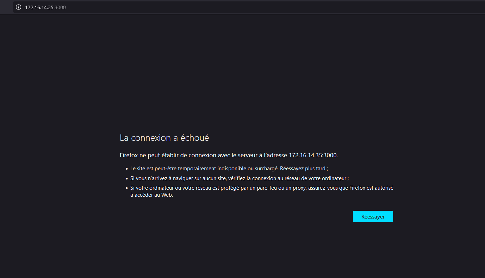

# Architeture des logiciels : Laboratoire 2

## 1. Déploiement avec distribution de charge

2.  Pour l'adresse IP, au lieu de la hardcoder, je la récupère grâce au package "socket" :

```python
def hello_world():
    return "<h2>Hello, World! From KM: " + socket.gethostbyname(socket.gethostname()) + "</h2>"
```

1. Le navigateur affiche bien notre "hello world".


6. Si le serveur est arrêté, la page est inaccessible.

